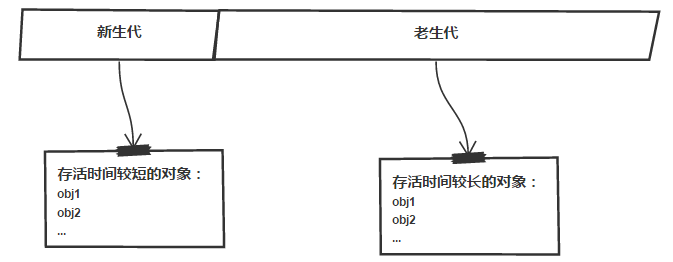
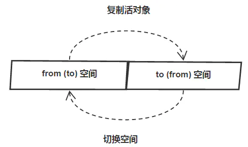
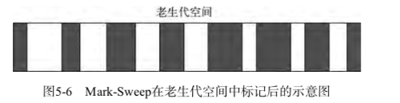
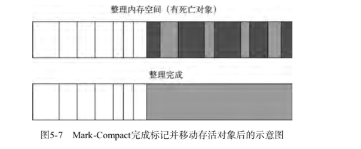
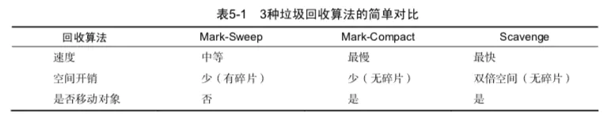
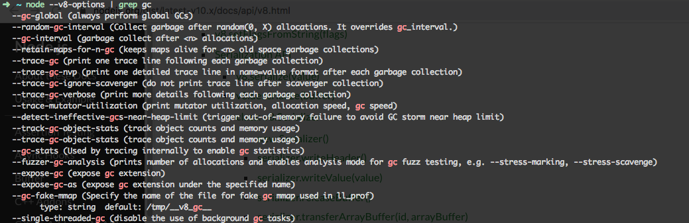
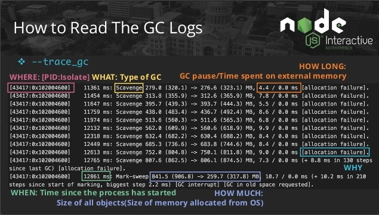

### 事情起因
在使用webpack进行打包代码的时候，出现node内存溢出的情况。翻阅资料发现v8中对于node内存做了限制。  
### v8的内存限制
Node中通过JavaScript只能使用部分内存（64位约1.4G，32位约0.7G）。V8对内存做了限制。因此这种限制下，将会导致Node无法直接操作大内存对象。
### v8内存限制的原因
- 首先V8最初是为浏览器而设计的，前期足以满足网页端的需求。就算浏览器真正出现溢出状况，关掉重启就好。
- 深层原因是V8的垃圾回收机制。垃圾回收时，js线程会暂停执行（避免JS应用逻辑与垃圾回收器看到的不一样），大量的堆内存回收严重影响性能。以1.5G垃圾回收堆内存为例，V8做一次非增量式的垃圾回收要1秒以上。比如：亚马逊发现100ms的延时会损失他们1%的销售额
- 可以手工调整内存大小（这个方法帮助我解决了webpack打包时node内存溢出的问题）。只能在启动node时指定，不能动态调整。
```js 
node --max-old-space-size=1700 app.js  //单位为MB。设置老生代
node --max-new-space-size=1024 app.js //单位为KB。设置新生代
```
### v8垃圾回收机制
在V8中所有的JavaScript对象都是通过堆来分配的。为了提高垃圾回收的效率，V8将堆分为新生代和老生代两个部分，其中新生代为存活时间较短的对象(需要经常进行垃圾回收)，而老生代为存活时间较长或常驻内存的对象(垃圾回收的频率较低)


新生代Scavenge(skævɪndʒ)算法
- 新生代主要采用复制的方式实现垃圾回收算法，将内存一分为二，每一部分空间成为semispace(半空间)
- 这两个semispace中，只有一个处于使用中（From空间），另一个处于闲置状态（To空间）。在分配对象时，首先在From空间中进行分配。当进行垃圾回收时，会检查From空间的存活对象，并把这些存活对象赋值到To空间中，非存活对象的空间将会被释放。完成复制后，From空间与To空间的角色发生对换。
- 新生代垃圾回收的过程，就是将存活对象在两个semispace空间之间进行复制。
- 很明显，Scavenge算法的确定是只能使用堆内存的一半。但是Scavenge只复制存活对象，对于生命周期短的场景存活对象只占少部分。因此它在时间效率上有优异的表现
- Scavenge算法是典型的以空间换时间的算法，所以很适用于新生代中，因为新生代中对象的生命周期较短。

### 晋升
对象从新生代中移动到老生代中的过程称为晋升  
晋升条件主要有两个：
- 对象是否经历过一次 Scavenge 回收，是的话，则移动到老生代
- To 空间已经使用超过 25%，To 空间对象移动到老生代
设置 25% 这个限制值得原因是当这次 Scavenge 回收完成后，这个 To 空间将变成 From 空间，接下来的内存分配将在这个空间中进行，如果占比过高，会影响后续的内存分配。
### 老生代垃圾回收
V8使用了标记-清除算法 (Mark-Sweep)进行垃圾回收，并使用标记-压缩算法 (Mark-Compact)整理内存碎片，提高内存的利用率。回收算法步骤如下：
1. 对老生代进行第一遍扫描，标记存活的对象
2. 对老生代进行第二次扫描，清除未被标记的对象
3. 将存活对象往内存的一端移动
4. 清除掉存活对象边界外的内存
### Mark-Sweep
- Mark-Sweep在标记阶段遍历堆中所有对象，并标记活着的对象，在随后的的清除阶段中，只清除没有被标记的对象。
- 相对于Scavenge算法，Scavenge只复制活着的对象，而Mark-Sweep只清除死亡对象。或对象在新生代中占小部分，而死对象在老生代中占小部分。这就是这两种回收方式能高效处理的原因。
  
图中黑色部分标记为死亡的对象。

- Mark-Sweep 最大的问题是在进行一次标记清除回收后，内存空间会出现不连续的状态。这种内存碎片会对后续的内存分配造成问题，因为很可能出现需要分配一个大对象的情况，这时所有的碎片空间都无法完成此次分配，就会提前触发垃圾回收，而这次回收是不必要的。

### Mark-Compact
- 为了解决 Mark-Sweep 的内存碎片问题，Mark-Compact被提出来。Mark-Compact是在 Mark-Sweep的基础上演进而来的。它们的差别在于对象在标记为死亡后，在整理过程中，将活着的对象往一端移动，移动完成后，直接清理掉边界外的内存。


### 全停顿

在 Mark-Sweep 和 Mark-Compact 之间，由于 Mark-Compact 需要移动对象，所以它的执行速度不可能很快，所以在取舍上，V8 主要使用 Mark-Sweep，在空间不足以从新生代中晋升过来的对象进行分配时才使用 Mark-Compact 。为了避免出现 JavaScript应用逻辑与垃圾回收器看到的不一致的情况，垃圾回收的3种算法都需要将应用逻辑暂停下来，这种行为称为“全停顿” (stop-the-world)。
### 增量标记
增量标记就是在标记阶段，将原本要一口气停顿完成的动作改成增量标记(Incremental Marking)，也就是拆分为许多小“步进”，每做完一“步进”就让JavaScript应用逻辑执行一小会儿，垃圾回收和应用逻辑交替执行直到标记阶段完成
### 惰性清理
将内存中的死亡对象逐步进行清理，而不是一次性全部清理
### 其它优化方式
V8除了引入增量标记和惰性清理来减少垃圾回收的最大停顿时间，还引入了并行标记和并行清理，进一步利用多核性能降低每次停顿时间。
### 内存观察&GC日志
#### V8 options
```js
node --v8-options | grep gc
```

``` js
--trace-gc
```


其它内存监控工具
- easy-monitor 
- Alinode
- Node-heapdump
